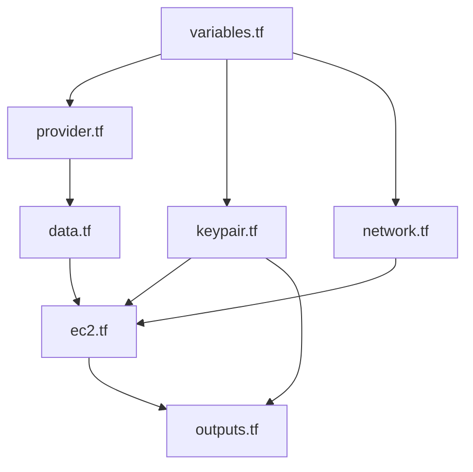

# Terraform AWS EC2 Setup

This repository contains Terraform configurations to provision an AWS EC2 instance with key networking resources. It includes modularized and cleanly documented `.tf` files for better maintainability and readability.

---

## ✨ Features

- Deploys an EC2 instance
- Creates a VPC, subnet, internet gateway, and route table
- Generates and uses an SSH key pair
- Uses variables for flexibility and reusability
- Outputs useful information like the instance public IP

---

## 📂 File Structure

```bash
.
├── data.tf            # Data sources like AMI lookup
├── ec2.tf             # EC2 instance definition
├── keypair.tf         # Key pair resource
├── network.tf         # VPC, subnet, IGW, route table
├── outputs.tf         # Output values
├── provider.tf        # AWS provider configuration
├── variables.tf       # Input variable definitions
├── version.tf         # Required Terraform and provider versions
```

---

## 🧩 File Purpose & Relationships

- ``: Declares required Terraform and AWS provider versions. *Needed before any other file can work.*
- ``: Configures the AWS provider, using values from `variables.tf`. *Required by every AWS resource block.*
- ``: Stores input values used across multiple files. *Used by **`provider.tf`**, **`ec2.tf`**, **`network.tf`**, and **`keypair.tf`**.*
- ``: Fetches the latest Amazon Linux 2 AMI. *Referenced in **`ec2.tf`**.*
- ``: Provisions the networking infrastructure (VPC, subnet, IGW). *`ec2.tf`** depends on the subnet created here.*
- ``: Creates the SSH key pair to log in to the instance. *`ec2.tf`** uses the key name.*
- ``: Deploys the EC2 instance using the AMI, subnet, and key pair. *Depends on **`data.tf`**, **`keypair.tf`**, and **`network.tf`**.*
- ``: Displays important values (like public IP) after applying. *Depends on values from **`ec2.tf`** and **`keypair.tf`**.*

---

## 🔁 Terraform Resource Flow Diagram (Mermaid)



This diagram shows the logical dependency between files:

- Variables power all major resource files.
- `provider.tf` and `data.tf` are foundational.
- The EC2 instance sits at the center and depends on many.

---

## ⚙️ Full Code With Comments

### `version.tf`

```hcl
# Specify Terraform and provider versions
terraform {
  required_version = ">= 1.0"
  required_providers {
    aws = {
      source  = "hashicorp/aws"
      version = ">= 4.0"
    }
  }
}
```

### `provider.tf`

```hcl
# Configure the AWS provider with selected region
provider "aws" {
  region = var.aws_region
}
```

### `variables.tf`

```hcl
# AWS Region input variable
variable "aws_region" {
  description = "AWS region to deploy resources"
  type        = string
  default     = "us-east-1"
}

# EC2 instance type
variable "instance_type" {
  description = "Type of EC2 instance"
  type        = string
  default     = "t2.micro"
}

# SSH key pair name
variable "key_name" {
  description = "Name of the SSH key pair"
  type        = string
}
```

### `data.tf`

```hcl
# Get the latest Amazon Linux 2 AMI from AWS
data "aws_ami" "amazon_linux" {
  most_recent = true
  owners      = ["amazon"]

  filter {
    name   = "name"
    values = ["amzn2-ami-hvm-*-x86_64-gp2"]
  }
}
```

### `network.tf`

```hcl
# Create a VPC
resource "aws_vpc" "main" {
  cidr_block = "10.0.0.0/16"
}

# Create a subnet within the VPC
resource "aws_subnet" "main" {
  vpc_id            = aws_vpc.main.id
  cidr_block        = "10.0.1.0/24"
  availability_zone = "${var.aws_region}a"
}

# Create an internet gateway for the VPC
resource "aws_internet_gateway" "gw" {
  vpc_id = aws_vpc.main.id
}

# Create a route table for the subnet
resource "aws_route_table" "public" {
  vpc_id = aws_vpc.main.id

  route {
    cidr_block = "0.0.0.0/0"
    gateway_id = aws_internet_gateway.gw.id
  }
}

# Associate the route table with the subnet
resource "aws_route_table_association" "a" {
  subnet_id      = aws_subnet.main.id
  route_table_id = aws_route_table.public.id
}
```

### `keypair.tf`

```hcl
# Create an AWS key pair from your local public SSH key
resource "aws_key_pair" "deployer" {
  key_name   = var.key_name
  public_key = file("~/.ssh/id_rsa.pub")
}
```

### `ec2.tf`

```hcl
# Launch an EC2 instance with the selected AMI, type, and key pair
resource "aws_instance" "web" {
  ami                         = data.aws_ami.amazon_linux.id
  instance_type               = var.instance_type
  subnet_id                   = aws_subnet.main.id
  key_name                    = aws_key_pair.deployer.key_name
  associate_public_ip_address = true

  tags = {
    Name = "TerraformEC2"
  }
}
```

### `outputs.tf`

```hcl
# Display public IP of the EC2 instance after apply
output "instance_public_ip" {
  value = aws_instance.web.public_ip
}

# Display key name used for instance
output "key_name" {
  value = aws_key_pair.deployer.key_name
}
```

---

## 🧪 Requirements

- Terraform >= 1.0
- AWS CLI configured with valid credentials

---

## ⚡ Quick Start

```bash
terraform init     # Initialize provider plugins
terraform plan     # Preview changes
terraform apply    # Apply infrastructure
terraform destroy  # Tear down
```

---

## 🔐 Security Notes

- Do not commit tfstate or tfvars with credentials
- Use `.gitignore` to exclude sensitive files

```gitignore
*.tfstate
*.tfstate.backup
*.tfvars
.terraform/
*.tfplan
crash.log
```

---

## 📤 Outputs

- `instance_public_ip`: IP of the EC2 instance
- `key_name`: SSH Key Pair used

---

## 🤝 Contributing

We welcome contributions! Please follow these steps:

1. **Fork the repository**
2. **Clone your fork** and create a feature branch:
   ```bash
   git checkout -b feature/my-feature-name
   ```
3. **Use semantic versioning** in branches when appropriate, e.g., `fix/v1.1-typo`, `feat/v1.2-add-instance-tag`
4. Make your changes with clear comments and reusable code.
5. **Commit your changes**:
   ```bash
   git commit -m "feat: add new instance tagging logic"
   ```
6. **Push to your fork**:
   ```bash
   git push origin feature/my-feature-name
   ```
7. **Create a Pull Request (PR)** against the `main` branch
8. Wait for review and feedback before merging

---

## 📚 Learn More

- [Terraform AWS Provider](https://registry.terraform.io/providers/hashicorp/aws/latest/docs)
- [Terraform CLI Docs](https://developer.hashicorp.com/terraform/cli)

---

## 🌟 Author Note

This project is a personal hands-on lab to master Terraform and automate cloud provisioning. Contributions and suggestions are welcome!

---

## 📖 License

MIT License
